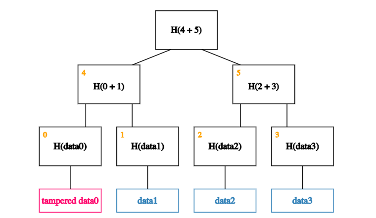
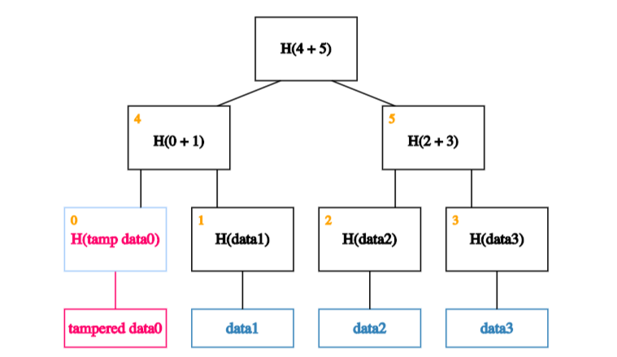
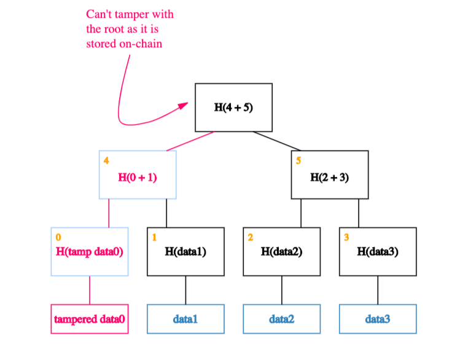
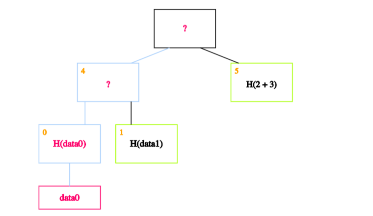
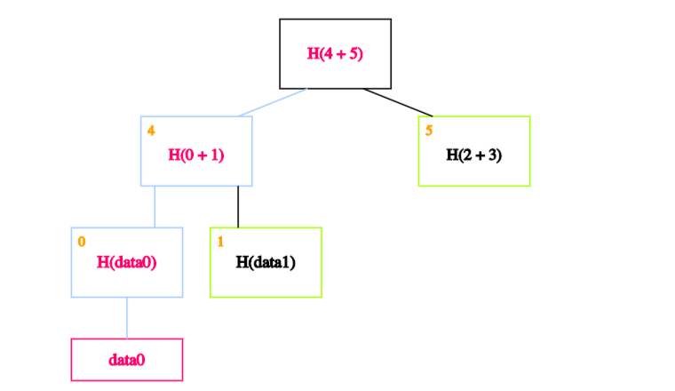

# Key concepts

## Identity

At iden3, our goal is to democratize identity. We believe that everyone should be empowered to become their own [certification authority](https://en.wikipedia.org/wiki/Certificate_authority).

What do we mean by identity?

An identity can be a person, a company, an organization, a [DAO](https://hackernoon.com/what-is-a-dao-c7e84aa1bd69), a government. An identity can even be a thing: a chair, a room, a bot...

When we talk about identities we are referring to identities as accounts.

Generally speaking, these accounts are going to be smart contracts. So **you can think of identities as smart contracts**, where the address of the contract is the identifier of that identity.

Key takeaways:

- **Anything** can be an identity

- One person can define and have many identities

- In Ethereum, an identity is an **account** or a smart contract

## Claims

An [identity](basics/key-concepts#identity.md)  can provide a claim. You can think of a claim as a statement: something an identity is saying.

Most of the time, these statements refer to other identities. In other words **claims usually create relations between identities.**

For example, when a university (identity) says that a student (identity) has a degree, this is a statement (claim) about the student. This statement creates a relation between the student and the university.

**Claims can be public or private.** And it turns out that almost anything we say or do can be thought of as a claim. Company invoices, Facebook likes, email messages, can all be thought of as claims.

### Examples of claims

- A certificate (e.g. birth certificate)

- A debt recognition

- An invoice

- An Instagram "Like"

- An endorsement (reputation)

- An email

- A driving license

- A role in a company

- ... Almost anything!

### Direct claims

If an identity wants to create many claims, they can put them all in a database, construct a [Merkle tree](basics/key-concepts#merkle-trees) of that database, and just publish (with a transaction) the root of the Merkle tree on-chain.

If the identity wants to update the claims later, they repeat the same process and just publish the new root of the Merkle tree.

For example, one could imagine a government adding/modifying millions of claims in a single transaction.

### Indirect claims

While direct claims scale really well for identities that make a lot of claims (since millions of claims can be batched in a single transaction), the average user will probably only need to make a few claims a day, and so won't benefit from this batching.

This is where indirect claims come in handy. Instead of having to pay gas everytime to update the Merkle root on-chain, indirect claims allow users to send claims off-chain to a **relayer**.

The idea is that with relayers, millions of users can create millions of claims on mainnet **without** spending any **gas** (since the relayer is responsible for batching the claims and publishing the transactions).

On top of this, using [zero knowledge proofs](basics/key-concepts#zero-knowledge-proofs) we can ensure that the relayer is trustless. In other words we can make sure the relayer can't lie about the claims we sent them. The worst they can do is not publish them (and if this happens we as the user always have the choice to change relayers).

## Zero knowledge proofs

*In cryptography, a zero-knowledge proof or zero-knowledge protocol is a method by which one party (the prover) can prove to another party (the verifier) that they know a value x, without conveying any information apart from the fact that they know the value x.* [Source](https://en.wikipedia.org/wiki/Zero-knowledge_proof) 

In other words, zero-knowledge proofs allow us to prove something specific without revealing any extra information.

Why do we care? Simply put, when we're talking about claims, sometimes we want to prove things in a private way.

### Examples

#### Nightclub entry

Say you want to enter a nightclub, and you need to prove to the bouncer that you are over 18. But you don't want to reveal to him your name, address, or anything else that's not relevant.

With a zero-knowledge proof you can prove that you hold the key that belongs to an identity that the state says is over 18, without revealing anything else about that identity.

#### ICO participation

Say an ICO is only available to KYC or authorized users. With ZK proofs you can prove that you are an authorized person to participate in the ICO without revealing who you are or how much you spent.

#### Anonymous Voting

Similar to the above, ZK proofs allow you to prove that you are an eligible identity, without revealing your identity.

### Non-reusable proofs

A non-reusable proof is a received proof that is not valid to send to a third identity.

For example, imagine that you belong to a political party, P. And P has made a private claim that you belong to it.

Say that you want to prove to another identity that you belong to P, but you don't want that other identity to be able to pass on that proof to others. In other words, you want to make sure the proof stays between the two of you.

We can do this using zero-knowledge proofs.

How?

To prove something -- let's call it A -- we can create a new proof B that is valid either if A is valid or we know the private key of the recipient, R.

*image coming soon*

Clearly we don't know R's private key, so when we share a valid proof B with R, R knows that A must be valid.

*image coming soon*

To see why B is non-reusable. Suppose R wants to share B with another recipient R'.

*image coming soon*

Now, from the perspective of R', B is valid either if A is valid or R knows her own private key.

*image coming soon*

But since R clearly knows her own private key, R' can't tell whether A is valid.

*image coming soon*

### zk-snarks

You can think of zk-snarks as an efficient way to produce zero-knowledge proofs. Proofs that are short enough to publish to a blockchain and that can be read later by a verifier.

## Merkle trees

A Merkle tree is a [binary tree](https://en.wikipedia.org/wiki/Binary_tree) built using hash pointers (if you're unfamiliar with what a hash pointer or function is, see the definitions section at the bottom of the page).

We care about Merkle trees because we want to build a data structure that:

1. Can store lots of data (**scalability**)
2. Makes it easy to prove that some data exists (**proof of membership**)
3. Allows us to check that data hasn't been altered (**tamper resistance**)

Merkle trees satisfy these three properties.

### Specification

Before we take a closer look at the above properties, let's go through how to build a Merkle tree given some data.

Suppose we have a number of blocks containing data. And that these blocks make up the leaves of our tree.

The first step is to create a parent node for each data block. These parent nodes make up the next level in the tree and store the hash of their descendent data block.

Next, we group the parent nodes into pairs, and store their hashes one level up the tree.

We continue doing this until we reach a single block, the root of the tree.

### Tamper resistance

It turns out that any attempt to tamper with any piece of data can be detected by simply remembering the hash at the root of the tree.

To understand why this is the case, let’s look at what happens if an adversary wants to tamper with a data block.

If an adversary tampers with a block at the leaf of our tree.

That will cause the hash in the node that’s one level up to not match.

So he’ll have to tamper with that too.

Which means, he’ll have to tamper with the node one level up from there.

And so on… Eventually he’ll get to the root. If he tries to tamper with the root, we’ll know because this is the node we’ve kept track of.

### Proof of membership

Merkle trees allow us to quickly check membership (through a neat mechanism known as Merkle proofs).. What do we mean by that?

Say that, as usual, we remember just the root (on-chain). And we want to prove that a certain data block - data0, say - is a member of the Merkle tree.

All we need are the blocks on the path from the data block to the root.

And each of data0's siblings on the way up the path.

We can ignore the rest of the tree, as these blocks are enough to allow us to verify the hashes all the way up to the root of the tree. How exactly?

The idea is to recalculate the root by recursively hashing the data we want to prove exists. If the calculated root is equal to the on-chain root, this proves the data block exists in the Merkle tree.

In our case, we start by calculating the hash of data0 and storing it in the block labelled 0.

We then calculate the hash of the hash of data0 concatenated with the hash of data1 - in other words, the hash of the concatenation of blocks 0 and 1 - and store it in block 4.

Finally, we calculate the hash of blocks 4 and 5 to obtain the recalculated root.

If the calculated root is equal to the on-chain root, we’ve proven that data0 exists in the Merkle tree.

In technical terms:

*This means that if there are n nodes in the tree, only about log(n) items need to be shown. And since each step just requires computing the hash of the child block, it takes about log(n) time for us to verify it. And so even if the Merkle tree contains a very large number of blocks, we can still prove membership in a relatively short time. Verification thus runs in time and space that’s logarithmic in the number of nodes in the tree.* [Source](https://d28rh4a8wq0iu5.cloudfront.net/bitcointech/readings/princeton_bitcoin_book.pdf) (pg 35)

### Scalability

Storing data on a blockchain is expensive. Merkle trees help us minimize the amount of data stored on chain.

How so? As we saw in the previous sections, to ensure tamper resistance and proof of membership we only need to store the root of the tree, not the whole tree. This means that, no matter how big the tree is, the only piece of data we actually need to store on chain is the root.

### Why we use Merkle trees at iden3

At iden3, one of our major goals is scalability. Specifically, we believe anybody should be able to create as many identities as they want. And that **any identity should be able to generate as many claims as they want.**

Imagine if you had to make a new transaction to the blockchain every time you wanted to make a new claim? Even worse, imagine you're a government and you're responsible for making millions of claims every day...

To achieve this goal requires minimizing the amount of data stored on chain. This is where Merkle trees come in.

Even if you're a government that's making millions of claims a day, you can just contruct a tree (off chain) with each claim as a separate data block, and simply calculate and store the root on chain.

In other words, Merkle trees allow prolific claim generators to add/modify **millions of claims** in a single transaction.

This makes it easy to scale claims.

### Definitions

#### Hash functions

A hash function basically maps an input string of any size to an output string of a fixed size.

It must be efficiently computable (by that we mean that for any given input string, we can figure out the output of the hash function in a reasonable amount of time. More technically, computing the hash of an n‐bit string should have a running time that is O(n).

For a hash function to be cryptographically secure, it must have three additional properties: 

1. Collision resistance
2. Hiding
3. Puzzle-friendliness

While we won't get into the details here, let's briefly discuss what each of these properties mean.

**Collision resistance** means that nobody can find two inputs that map to the same output.

**Hiding** means that given an output there's no feasible way to figure out the input that generated it.

**Puzzle-friendliness** is a little more complicated. Intuitively it means it's very hard to target the hash function to come out to some particular output value y. Don't worry if you don't see why this property is useful, for our purposes, it isn't very important.

#### Hash pointers

A hash pointer is simply a pointer to where some information is stored together with a cryptographic hash of the
information. **A pointer gives you a way to retrieve the information, whereas a hash pointer also gives you a way to verify that the information hasn’t changed.**

In other words, a hash pointer is a pointer to where data is stored together with a cryptographic hash of the value of that data at some fixed point in time.

If at some point in the future, we want to check the data hasn't changed, we simply hash the data again and check that the new output (cryptographic hash) matches the previous output. This works because we know by the **collision resistance** property of the hash function, that nobody can find two inputs that map to the same output. So if the output is the same, the input must also have been the same.

