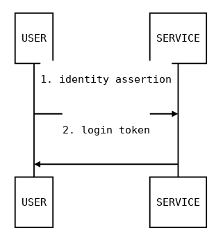
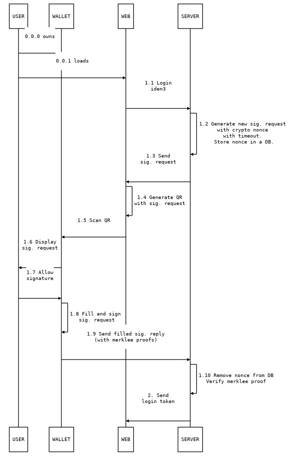

Login Protocol
==============

Login protocol
--------------

The login protocol is based on the signature protocol, in which a user
signs a packet using an authorized kSign key.

For the login case, the user desires to assert a particular identity (an
ethereum address in this case) to a server so that they are allowed
access into the service while being identified.



### Assumptions

-   Secure connection between Wallet and Server.
-   Secure connection between Web Client and Server.
-   Wallet authenticates the Server in the connection.
-   Web Client authenticates the Server in the connection.

### What is needed

-   Server authenticates the Ethereum Address and Ethereum Name from the
    Wallet.
-   The user transfers the authentication from the Wallet to the Web
    Client.

### Protocol flow



Challenges contain a cryptographic nonce and have a timeout that
indicates the validity of the nonce in the challenge. A signed challenge
with a timed out nonce must be rejected by the server. The server must
store a list of not timed out nonces that haven’t been signed yet to
guarantee freshness.

A cryptographic nonce must be securely generated and long enough to
avoid colisions (we use 256 bits).

### Signature Protocol v0.1 spec

A signature may be requested as follows:

    {
      header: {
        typ: iden3.sig.v0_1
      }
      body: {
        type: TYPE
        data: DATA
      }
    }

The user will generate a packet following the signature protocol
specification, that may contain data from a signature request, or may be
made from scratch. The packet contains a header and a payload, and is
serialized and signed following the [JWS
standard](https://tools.ietf.org/html/rfc7515). Usually the `form` will
be filled by the user, and `data` will be copied from a request.

The structure of the `data` and `form` in the payload are specified by
the `type` (what is being signed) in the payload. The rest of the
elements are specified by the `typ` (signature packet) in the header.

    JWS_PAYLOAD = {
      type: TYPE
      data: DATA
      form: FORM
      ksign: str # ksing public key in compressed form
      proofKSing: proofClaim # Proof of authorize k sign claim (which contains the public key in compressed form)
    }

    JWS_HEADER = {
      typ: iden3.sig.v0_1
      iss: str # Ethereum Address
      iat: uint # issued at time, unix timestamp
      exp: uint # expiration time, unix timestamp
      alg: ? # algorithm
    }

    JWS_SIGN(JWS_HEADER, JWS_PAYLOAD)

Each Signature request `type` has a view representation for the user,
where the `data` and `form` are presented. Some of the values may be
hidden from the user when necessary, but only if doing so doesn’t
compromise the security of the user. In the request view, the user has
the ability to pick some elements of the `form`.

`ksign` is the compressed public key of a secp256k ECDSA key pair. The
`proofKSing` contains a KSign Authorize Claim for a secp256k public key.

As `JWS_HEADER.alg` we will use a custom algorithm (not defined in the
JWS standard): “EK256K1”, which is ECDSA with secp256k1 curve and keccak
as hash function, the same signature algorithm configuration used in
Ethereum.

#### Auxiliary data structures

    proofClaim: {
        signature: signature # Relay root + date signed by relay
        date: uint
        leaf: claim
        proofs: proofClaimPartial[]
    }

    proofClaimPartial: {
        mtp0: mtp # merkle tree proof of leaf existence
        mtp1: mtp # merkle tree proof of leaf non-existence
        root: key # merkle tree root
        aux: nil | { ver: uint, era: uint, idAddr: str } # Necessary data to construct SetRootClaim from root
    }

Usually the relay returns the `proofClaim` data structure to prove that
a claim is valid and is in the merkle tree.

### Identity Assertion v0.1 spec

payload:

    type: iden3.iden_assert.v0_1
    data: {
      challenge: nonce # 256 bits in base64
      timeout: uint # seconds
      origin: str # domain
    }
    form: {
      ethName: str # ethereumName
      proofAssignName: proofClaim # proof of claim Assign Name for ethName
    }

A session id, if necessary, can be computed from the challenge. This
session id can be used to link the communication between the web service
and the wallet service.

view:

    type: Identity Assertion
    data: {
      origin: str # domain
    }
    form: {
      ethName: str # ethereum name
    }

### Algorithms

Here we show an overview of the algorithms steps used for verification
of the proofs and signatures used in the login protocol. The following
algorithms consider the case in which there is a only a single trusted
entity (identified by `relayPk`) that acts as a relay and as a domain
name server.

#### Signature verification algorithm

    VerifySignedPacket(jwsHeader, jwsPayload, signature, relayPk):
    1. Verify jwsHeader.typ is 'iden3.sig.v0_1'
    2. Verify jwsHeader.alg is 'EK256K1'
    3. Verify that jwsHeader.iat <= now() < jwsHeader.exp 
    4. Verify that jwsPayload.ksign is in jwsPayload.proofKSign.leaf
    5. Verify that jwsHeader.iss is in jwsPayload.proofKSign
    6. Verify that signature of JWS(jwsHeader, jwsPayload) by jwsPayload.ksign is signature
    7. VerifyProofOfClaim(jwsPayload.proofKSign, relayPk)

In 4. we verify that the ksign used to sign the packet is authorized by
the user, identified by jwsHeader.iss ethereum address.

#### Iden Assert verification algorithm

    VerifyIdenAssertV01(nonceDB, origin, jwsHeader, jwsPayload, signature, relayPk):
    1. Verify jwsPayload.type is 'iden3.iden_assert.v0_1'
    2. Verify jwsPayload.data.origin is origin
    3. Verify jwsPayload.data.challenge is in nonceDB and hasn't expired, delete it
    4. Verify that jwsHeader.iss and jwsPayload.form.ethName are in jwsPayload.proofAssignName.leaf
    5. VerifyProofOfClaim(jwsPayload.form.ethName, relayPk)

#### ProofOfClaim verification

    VerifyProofOfClaim(p, relayPk):
    1. Verify signature of p.proofs[-1].root by relayPk is p.signature
       let leaf = p.leaf
    2. loop for each proof in p.proofs:
        2.1 Verify proof.mtp0 is existence proof
        2.2 Verify proof.mtp0 with leaf and proof.root
        2.3 Verify proof.mtp1 is non-existence proof
        2.4 Verify proof.mtp1 with ClaimIncrementVersion(leaf) and proof.root
            leaf = NewClaimSetRootClaim(p.root, p.aux.ver, p.aux.era, p.aux.ethAddr)

### Rationale

See [this document](login_spec_rationale.md) for the rationale of some
decisions made in the design of this protocol.

iden3js - protocols
-------------------

### Login (Identity Assertion)

    Wallet                                   Service
      +                                         +
      |           signatureRequest              |
      | <-------------------------------------+ |
      |                                         |
      | +---+                                   |
      |     |                                   |
      |     |sign packet                        |
      |     |                                   |
      | <---+                                   |
      |              signedPacket               |
      | +-------------------------------------> |
      |                                         |
      |                                  +---+  |
      |                      verify      |      |
      |                      signedPacket|      |
      |                                  |      |
      |                                  +--->  |
      |                                         |
      |                 ok                      |
      | <-------------------------------------+ |
      |                                         |
      |                                         |
      |                                         |
      +                                         +

Read the login protocol specification [here](login_spec.md).

#### Define new NonceDB

``` {.sourceCode .js}
const nonceDB = new iden3.protocols.NonceDB();
```

#### Generate New Request of Identity Assert

-   input
    -   `nonceDB`: NonceDB class object
    -   `origin`: domain of the emitter of the request
    -   `timeout`: unixtime format, valid until that date. We can use
        for example 2 minutes (`2*60` seconds)
-   output

    -   `signatureRequest`: `Object`

    ``` {.sourceCode .js}
    const signatureRequest = iden3.protocols.login.newRequestIdenAssert(nonceDB, origin, 2*60);
    ```

The `nonce` of the `signatureRequest` can be getted from:

``` {.sourceCode .js}
const nonce = signatureRequest.body.data.challenge;
// nonce is the string containing the nonce value
```

We can add auxiliar data to the `nonce` in the `nonceDB` only one time:

``` {.sourceCode .js}
const added = nodeDB.addAuxToNonce(nonce, auxdata);
// added is a bool confirming if the aux data had been added
```

#### Sign Packet

-   input
    -   `signatureRequest`: object generated in the
        `newRequestIdenAssert` function
    -   `userAddr`: Eth Address of the user that signs the data packet
    -   `ethName`: name assigned to the `userAddr`
    -   `proofOfEthName`: `proofOfClaim` of the `ethName`
    -   `kc`: iden3.KeyContainer object
    -   `ksign`: KOperational authorized for the `userAddr`
    -   `proofOfKSign`: `proofOfClaim` of the `ksign`
    -   `expirationTime`: unixtime format, signature will be valid until
        that date
-   output

    -   `signedPacket`: `String`

    ``` {.sourceCode .js}
    const expirationTime = unixtime + (3600 * 60);
    const signedPacket = iden3.protocols.login.signIdenAssertV01(signatureRequest, usrAddr, ethName, proofOfEthName, kc, ksign, proofOfKSign, expirationTime);
    ```

#### Verify Signed Packet

-   input
    -   `nonceDB`: NonceDB class object
    -   `origin`: domain of the emitter of the request
    -   `signedPacket`: object generated in the `signIdenAssertV01`
        function
-   output

    -   `nonce`: nonce object of the signedPacket, that has been just
        deleted from the nonceDB when the signedPacket is verified. If
        the verification fails, the nonce will be `undefined`

    ``` {.sourceCode .js}
    const verified = iden3.protocols.login.verifySignedPacket(nonceDB, origin, signedPacket);
    ```

#### Appendix

See the [login specification document](login_spec.md) for information
about the protocol design.

Rationale
---------

The following document contains references to similar protocols on which
our login protocol relies on or takes inspiration from.

### Signature format

Use JSON to encode the object that will be signed.

#### JSON Signing formats

<https://medium.facilelogin.com/json-message-signing-alternatives-897f90d411c>

-   JSON Web Signature (JWS)
    -   Doesn’t need canonicalization
    -   Allows signing arbitrary data (not only JSON)
    -   Widely used
-   JSON Cleartext Signature (JCS)
-   Concise Binary Object Representation (CBOR) Object Signing

<https://matrix.org/docs/spec/appendices.html#signing-json>

-   Matrix JSON Signing
    -   Allows having multiple signatures with different protocols for a
        single JSON

### Possible attacks

See WebAuth API, FIDO Threat analysis

### References

-   <https://en.wikipedia.org/wiki/OpenID>
-   <https://en.wikipedia.org/wiki/OpenID_Connect>
-   <https://en.wikipedia.org/wiki/IndieAuth>
-   <https://fidoalliance.org/how-fido-works/>

#### WebAuth API

-   <https://developer.mozilla.org/en-US/docs/Web/API/Web_Authentication_API>
-   <https://w3c.github.io/webauthn/>
-   <https://www.w3.org/TR/webauthn/>

Demo: - <https://www.webauthn.org/>

FIDO Security guarantees and how they are achieved:
-<https://fidoalliance.org/specs/fido-v2.0-id-20180227/fido-security-ref-v2.0-id-20180227.html#relation-between-measures-and-goals>
- FIDO Threat analysis and mitigations:
-<https://fidoalliance.org/specs/fido-v2.0-id-20180227/fido-security-ref-v2.0-id-20180227.html#threat-analysis>

Currently (2018-01-08) there’s no support for iOS (Safari):
-<https://developer.mozilla.org/en-US/docs/Web/API/Web_Authentication_API#Browser_compatibility>

Criticism: - <https://www.scip.ch/en/?labs.20180424>

Example code of server verification:
-<https://github.com/duo-labs/webauthn/blob/fa6cd954884baf24fc5a51656ce21c1a1ef574bc/main.go#L336>
- <https://w3c.github.io/webauthn/#verifying-assertion>

### Appendix

#### The FIDO protocols security goals:

##### [SG-1]

Strong User Authentication: Authenticate (i.e. recognize) a user and/or
a device to a relying party with high (cryptographic) strength. \#\#\#\#
[SG-2] Credential Guessing Resilience: Provide robust protection against
eavesdroppers, e.g. be resilient to physical observation, resilient to
targeted impersonation, resilient to throttled and unthrottled guessing.
\#\#\#\# [SG-3] Credential Disclosure Resilience: Be resilient to
phishing attacks and real-time phishing attack, including resilience to
online attacks by adversaries able to actively manipulate network
traffic. \#\#\#\# [SG-4] Unlinkablity: Protect the protocol conversation
such that any two relying parties cannot link the conversation to one
user (i.e. be unlinkable). \#\#\#\# [SG-5] Verifier Leak Resilience: Be
resilient to leaks from other relying parties. I.e., nothing that a
verifier could possibly leak can help an attacker impersonate the user
to another relying party. \#\#\#\# [SG-6] Authenticator Leak Resilience:
Be resilient to leaks from other FIDO Authenticators. I.e., nothing that
a particular FIDO Authenticator could possibly leak can help an attacker
to impersonate any other user to any relying party. \#\#\#\# [SG-7] User
Consent: Notify the user before a relationship to a new relying party is
being established (requiring explicit consent). \#\#\#\# [SG-8] Limited
PII: Limit the amount of personal identifiable information (PII) exposed
to the relying party to the absolute minimum. \#\#\#\# [SG-9] Attestable
Properties: Relying Party must be able to verify FIDO Authenticator
model/type (in order to calculate the associated risk). \#\#\#\# [SG-10]
DoS Resistance: Be resilient to Denial of Service Attacks. I.e. prevent
attackers from inserting invalid registration information for a
legitimate user for the next login phase. Afterward, the legitimate user
will not be able to login successfully anymore. \#\#\#\# [SG-11] Forgery
Resistance: Be resilient to Forgery Attacks (Impersonation Attacks).
I.e. prevent attackers from attempting to modify intercepted
communications in order to masquerade as the legitimate user and login
to the system. \#\#\#\# [SG-12] Parallel Session Resistance: Be
resilient to Parallel Session Attacks. Without knowing a user’s
authentication credential, an attacker can masquerade as the legitimate
user by creating a valid authentication message out of some eavesdropped
communication between the user and the server. \#\#\#\# [SG-13]
Forwarding Resistance: Be resilient to Forwarding and Replay Attacks.
Having intercepted previous communications, an attacker can impersonate
the legal user to authenticate to the system. The attacker can replay or
forward the intercepted messages. \#\#\#\# [SG-14] (not covered by U2F)
Transaction Non-Repudiation: Provide strong cryptographic
non-repudiation for secure transactions. \#\#\#\# [SG-15] Respect for
Operating Environment Security Boundaries: Ensure that registrations and
private key material as a shared system resource is appropriately
protected according to the operating environment privilege boundaries in
place on the FIDO user device. \#\#\#\# [SG-16] Assessable Level of
Security: Ensure that the design and implementation of the Authenticator
allows for the testing laboratory / FIDO Alliance to assess the level of
security provided by the Authenticator.
